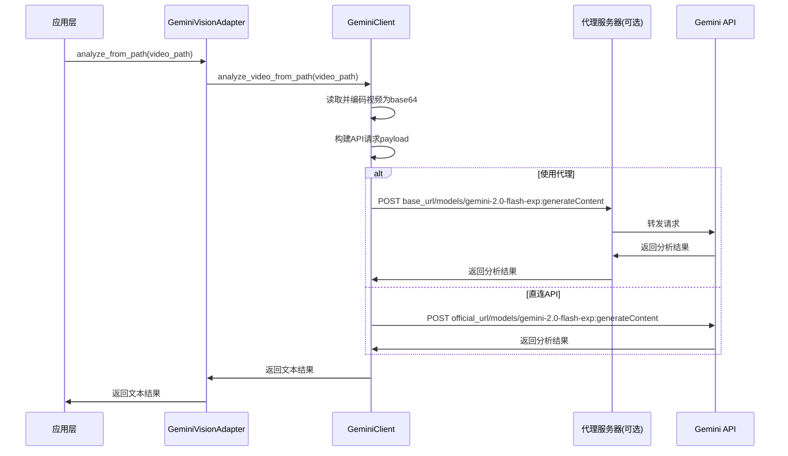

# Gemini视频分析集成指南

## 概述

本文档介绍如何在Auto-Clip项目中使用Google Gemini进行视频内容理解和分析。

## 核心特性

✅ **支持自定义Base URL**：可配置代理服务器地址
✅ **原生视频理解**：Gemini 2.0 Flash原生支持视频分析
✅ **灵活接口**：支持本地文件和base64两种输入方式
✅ **适配器模式**：符合项目SOLID架构原则
✅ **可切换服务**：通过配置在DashScope和Gemini之间切换

## 架构设计

```
┌─────────────────────────────────────────────────────┐
│           视频分析业务层                              │
│         (VideoAnalyzer Service)                     │
└─────────────────────┬───────────────────────────────┘
                      │
          ┌───────────┴───────────┐
          │                       │
┌─────────▼─────────┐   ┌────────▼────────┐
│ DashScope Adapter │   │ Gemini Adapter  │
│  (现有实现)        │   │   (新增支持)    │
└─────────┬─────────┘   └────────┬────────┘
          │                       │
┌─────────▼─────────┐   ┌────────▼────────┐
│ DashScope Client  │   │ Gemini Client   │
│  (qwen-vl-plus)   │   │ (gemini-2.0)    │
└───────────────────┘   └─────────────────┘
```

## 文件结构

```
app/
├── utils/ai_clients/
│   ├── dashscope_client.py      # 阿里云DashScope客户端
│   └── gemini_client.py         # Google Gemini客户端（新增）
├── adapters/
│   ├── vision_adapters.py       # DashScope视觉分析适配器
│   └── gemini_vision_adapter.py # Gemini视觉分析适配器（新增）
└── config.py                    # 配置文件（已更新）

test_gemini_video_analysis.py   # Gemini集成测试脚本（新增）
```

## 快速开始

### 1. 获取API密钥

访问 [Google AI Studio](https://aistudio.google.com/app/apikey) 获取免费的Gemini API密钥。

### 2. 配置环境变量

在 `.env` 文件中添加以下配置：

```bash
# Gemini配置（必填）
GEMINI_API_KEY=your_gemini_api_key_here

# 可选：自定义Base URL（用于代理访问）
GEMINI_BASE_URL=https://your-proxy-server.com/api

# 可选：指定模型
GEMINI_MODEL=gemini-2.0-flash-exp

# 切换视觉分析服务到Gemini
VISION_SERVICE=gemini
```

### 3. 运行测试

```bash
# 安装依赖
pip install httpx rich

# 运行测试脚本
python test_gemini_video_analysis.py
```

## 使用方式

### 方式1：直接使用GeminiClient

```python
from app.utils.ai_clients.gemini_client import GeminiClient

# 初始化客户端
client = GeminiClient(
    api_key="your_api_key",
    base_url="https://your-proxy.com/api",  # 可选
    model="gemini-2.0-flash-exp"
)

# 分析本地视频
result = await client.analyze_video_from_path(
    video_path="/path/to/video.mp4",
    prompt="请分析视频中的关键场景和人物动作"
)

# 分析base64编码的视频
result = await client.analyze_video_from_base64(
    video_base64="base64_encoded_video_data",
    prompt="请描述视频内容",
    mime_type="video/mp4"
)

# 纯文本对话
reply = await client.chat(
    prompt="请生成一段视频解说词",
    system_prompt="你是专业的视频解说员"
)
```

### 方式2：使用GeminiVisionAdapter（推荐）

```python
from app.adapters.gemini_vision_adapter import GeminiVisionAdapter

# 初始化适配器（自动读取配置）
adapter = GeminiVisionAdapter()

# 分析本地视频
result = await adapter.analyze_from_path(
    video_path="/path/to/video.mp4",
    prompt="请识别视频中的主要元素"
)

# 分析base64编码的视频
result = await adapter.analyze_from_base64(
    video_base64="base64_data",
    prompt="请分析视频内容"
)
```

### 方式3：在Service层集成

```python
from app.config import settings
from app.adapters.vision_adapters import DashScopeVisionAdapter
from app.adapters.gemini_vision_adapter import GeminiVisionAdapter

class VideoAnalyzerService:
    def __init__(self):
        # 根据配置选择视觉分析服务
        if settings.VISION_SERVICE == "gemini":
            self.vision_adapter = GeminiVisionAdapter()
        else:
            self.vision_adapter = DashScopeVisionAdapter()

    async def analyze_video(self, video_path: str, prompt: str):
        return await self.vision_adapter.analyze_from_path(
            video_path=video_path,
            prompt=prompt
        )
```

## 配置选项详解

### GEMINI_API_KEY

- **必填**：是
- **说明**：Google Gemini API密钥
- **获取方式**：https://aistudio.google.com/app/apikey
- **示例**：`AIzaSyAbc123...`

### GEMINI_BASE_URL

- **必填**：否
- **默认值**：`https://generativelanguage.googleapis.com/v1beta`
- **说明**：API基础URL，支持自定义代理地址
- **使用场景**：
  - 企业内网代理
  - 地区访问限制绕过
  - 本地开发Mock服务
  - 流量监控和日志记录

**示例配置**：

```bash
# 官方API（默认）
GEMINI_BASE_URL=https://generativelanguage.googleapis.com/v1beta

# 代理服务
GEMINI_BASE_URL=https://your-proxy.example.com/gemini/v1beta

# 本地开发
GEMINI_BASE_URL=http://localhost:8080/api
```

### GEMINI_MODEL

- **必填**：否
- **默认值**：`gemini-2.0-flash-exp`
- **说明**：使用的Gemini模型
- **可选值**：
  - `gemini-2.0-flash-exp`（推荐，视频支持）
  - `gemini-1.5-pro`（高级功能）
  - `gemini-1.5-flash`（快速响应）

### VISION_SERVICE

- **必填**：否
- **默认值**：`dashscope`
- **说明**：视觉分析服务选择
- **可选值**：
  - `dashscope`：使用阿里云DashScope（qwen-vl-plus）
  - `gemini`：使用Google Gemini（gemini-2.0-flash-exp）

## Base URL配置场景

### 场景1：直连官方API

```bash
# 不设置GEMINI_BASE_URL，或显式设置官方地址
GEMINI_BASE_URL=https://generativelanguage.googleapis.com/v1beta
```

**适用于**：
- 能直接访问Google服务的地区
- 个人开发和测试
- 小规模应用

### 场景2：通过代理访问

```bash
# 配置代理服务器地址
GEMINI_BASE_URL=https://your-proxy-server.com/api
```

**适用于**：
- 网络受限地区
- 企业内网环境
- 需要流量控制和监控

**代理服务器要求**：
- 支持POST请求
- 转发请求到Gemini官方API
- 处理认证（API Key通过查询参数传递）

### 场景3：本地Mock服务

```bash
# 配置本地Mock地址
GEMINI_BASE_URL=http://localhost:8080/gemini
```

**适用于**：
- 单元测试和集成测试
- 离线开发
- API成本控制

## API调用流程



## 错误处理

### 常见错误及解决方案

#### 1. API密钥未配置

```
ValueError: Gemini API密钥未配置，请设置GEMINI_API_KEY环境变量
```

**解决**：在`.env`文件中配置`GEMINI_API_KEY`

#### 2. 请求超时

```
LLMServiceError: Gemini API请求超时（>120秒）
```

**解决**：
- 检查网络连接
- 增加timeout参数：`GeminiClient(timeout=300)`
- 使用压缩后的视频文件

#### 3. Base URL配置错误

```
httpx.HTTPStatusError: HTTP错误 (404): Not Found
```

**解决**：
- 检查`GEMINI_BASE_URL`配置
- 确认代理服务器正常运行
- 留空使用官方地址

#### 4. 视频格式不支持

```
ValueError: 不支持的视频格式：.webm
```

**解决**：
- 使用支持的格式（mp4, mov, avi, mkv）
- 转换视频格式

## 性能优化建议

### 1. 视频预处理

```python
# 压缩视频以减少传输时间
from moviepy import VideoFileClip

clip = VideoFileClip("large_video.mp4")
compressed = clip.resized(height=480)  # 降低分辨率
compressed.write_videofile("compressed.mp4", bitrate="500k")
```

### 2. 并行处理

```python
import asyncio

async def analyze_multiple_videos(video_paths):
    adapter = GeminiVisionAdapter()
    tasks = [
        adapter.analyze_from_path(path, prompt)
        for path in video_paths
    ]
    return await asyncio.gather(*tasks)
```

### 3. 结果缓存

```python
from functools import lru_cache

@lru_cache(maxsize=100)
async def cached_analyze(video_hash: str, prompt: str):
    adapter = GeminiVisionAdapter()
    return await adapter.analyze_from_path(video_hash, prompt)
```

## 成本估算

Gemini 2.0 Flash定价（截至2025年1月）：

- **输入**：$0.00001875 / 1K tokens
- **输出**：$0.000075 / 1K tokens
- **视频处理**：按视频时长计费

**示例**：
- 1分钟视频分析 ≈ $0.001 - $0.005
- 1000个视频/月 ≈ $1 - $5

## 与DashScope对比

| 特性 | Gemini 2.0 Flash | DashScope (qwen-vl-plus) |
|------|------------------|--------------------------|
| **视频理解** | ✅ 原生支持，强大 | ✅ 支持 |
| **API可达性** | ⚠️ 部分地区受限 | ✅ 国内直连 |
| **自定义Base URL** | ✅ 支持 | ❌ 不支持 |
| **成本** | 较低 (~$0.002/视频) | 中等 |
| **响应速度** | 快 | 快 |
| **中文理解** | 良好 | 优秀 |
| **国际化** | 优秀 | 良好 |

## 最佳实践

### 1. 环境隔离

```bash
# 开发环境 - 使用Gemini（成本低）
VISION_SERVICE=gemini
GEMINI_BASE_URL=http://localhost:8080  # Mock服务

# 生产环境 - 使用DashScope（稳定）
VISION_SERVICE=dashscope
```

### 2. 降级策略

```python
class RobustVideoAnalyzer:
    async def analyze(self, video_path: str):
        try:
            # 优先使用Gemini
            adapter = GeminiVisionAdapter()
            return await adapter.analyze_from_path(video_path)
        except Exception as e:
            logger.warning(f"Gemini失败，降级到DashScope: {e}")
            # 降级到DashScope
            adapter = DashScopeVisionAdapter()
            return await adapter.analyze_from_path(video_path)
```

### 3. 提示词优化

```python
# 结构化提示词
ANALYSIS_PROMPT = """
请分析视频内容，按以下格式输出：
1. 主要场景：描述视频中的主要场景和环境
2. 关键人物：识别视频中的人物及其动作
3. 情感氛围：分析视频传达的情感基调
4. 关键时刻：标注重要的时间戳和事件

要求：
- 简洁明了，每项不超过50字
- 使用客观描述，避免主观评价
- 标注关键帧的时间戳
"""
```

## 故障排查

### 检查配置

```bash
# 验证环境变量
python -c "from app.config import settings; print(settings.GEMINI_API_KEY[:20] + '...')"
python -c "from app.config import settings; print(settings.GEMINI_BASE_URL)"
```

### 网络连通性测试

```bash
# 测试API连通性
curl -X POST \
  "https://generativelanguage.googleapis.com/v1beta/models/gemini-2.0-flash-exp:generateContent?key=YOUR_API_KEY" \
  -H "Content-Type: application/json" \
  -d '{"contents":[{"parts":[{"text":"Hello"}]}]}'
```

### 日志分析

查看日志文件中的Gemini相关日志：

```bash
grep "gemini" logs/app.log | tail -n 50
```

## 后续计划

- [ ] 支持流式响应（SSE）
- [ ] 支持Gemini视频URL直接分析
- [ ] 集成Gemini图像分析能力
- [ ] 添加更多模型选项（Pro版本）
- [ ] 实现智能重试和降级策略

## 参考资料

- [Gemini API官方文档](https://ai.google.dev/docs)
- [Google AI Studio](https://aistudio.google.com/)
- [Gemini定价](https://ai.google.dev/pricing)
- [项目SOLID架构文档](./SOLID_REFACTORING.md)

## 支持

如有问题，请提交Issue或联系开发团队。
